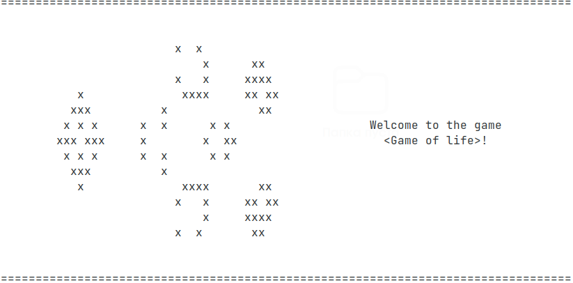
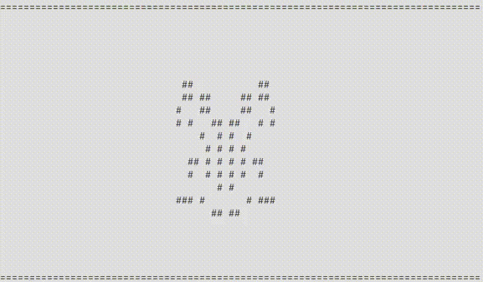
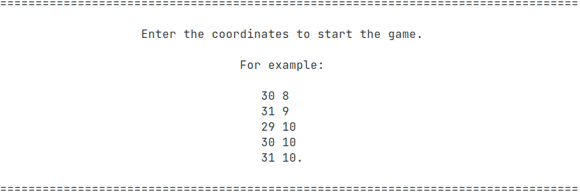
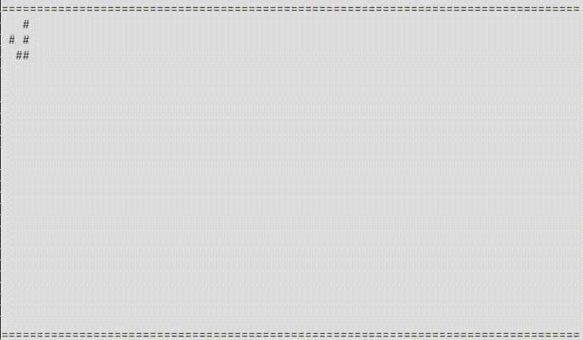

# Conway's Game of Life
[Conway's Game of Life](https://en.wikipedia.org/wiki/Conway%27s_Game_of_Life) on C language for terminal Linux.

## Libraries
- [`ncurses`](https://en.wikipedia.org/wiki/Ncurses) - for real-time mode 

Installing the ncurses library in Debian/Ubuntu Linux:
```
$ sudo apt install ncurses-bin
```
- [`unistd`](https://en.wikipedia.org/wiki/Unistd.h) - for the delay between cards in microseconds
- [`stdio`](https://www.tutorialspoint.com/c_standard_library/stdio_h.htm) - for other primitive actions (e. g. printf())
- [`stdlib`](https://www.tutorialspoint.com/c_standard_library/stdlib_h.htm) - for working with memory

## Compilation
Go to the Game-of-Life folder and enter in the terminal:
```
$ make
```
Compiled by Game_of_Life. Run Game_of_Life in the terminal:
```
$ ./Game_of_Life
```
## Gameplay
When you start the game, you are greeted by a welcome picture



You will be asked if you want to upload a finished image
```
$ Do you want to upload ready-made coordinates?[Y/N]
```
### Picture from file
If you answer yes, you will be asked to enter the name of the image file with the extension 'txt'
```
$ Enter the name of the prepared picture with the extension 'txt':
```
> Here the picture is a text file containing a matrix of zeros and ones. Examples are given in the Game-of-Life folder.

Example of the uploaded image:
```
$ Enter the name of the prepared picture with the extension 'txt':
$ Butterfly.txt
```


### Picture from coordinates
If you answered no, then you will be prompted to enter the image using the coordinates manually



> The coordinates are limited by the 80x20 field

Example of an image from coordinates:
```
$ 30 8
$ 31 9
$ 29 10
$ 30 10
$ 31 10.
```


### Control

You can interfere with the gameplay and introduce new live cells. 
To do this, activate the cursor using the `'K'` key.
If you press this key while the cursor is active, the cursor disappears from the screen.
To enter a live cell, press `'ENTER'` when the cursor is active.
To move the cursor around the field, use `'W'`, `'A'`, `'S'`, `'D'` - up, left, down, right.

You can change the speed of the game, use the keys to do this `'1'`, `'2'`, `'3'`, `'4'`, `'5'`, `'6'`, `'7'`, `'8'`, `'9'`, `'0'`.

You can pause the game by pressing the `'SPACE'`. To resume the game, press the space bar again.

If you forget which keys are responsible for what, you can call for help using the `'H'` key. In this case, the game will be paused.

To exit the game, press the `'ESC'` key.

## Settings

If you want to change drawing symbols, you can do it in ***constants.h***.

```
#define SYMBOL_BORT '='
#define SYMBOL_BORT_SIDE 'N'
#define SYMBOL_DEATH ' '
#define SYMBOL_LIVE '#'
#define SYMBOL_K_LIVE 'L'
#define SYMBOL_K_DEATH 'D'
```